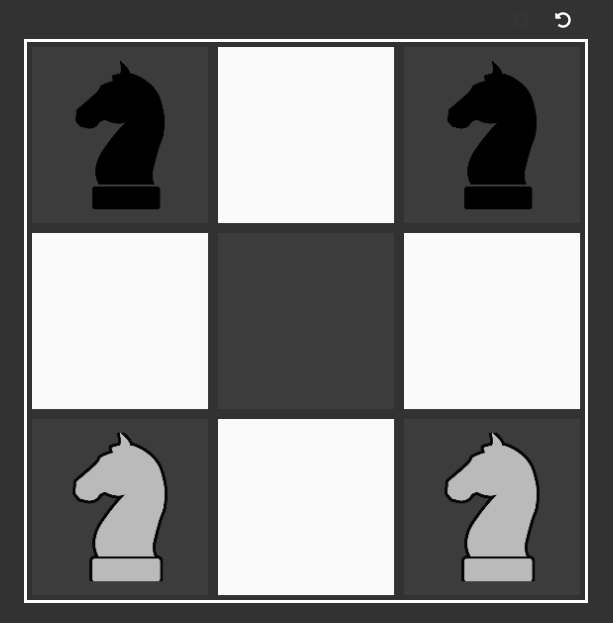

# Knights

Knights is a puzzle game based on [chess](https://en.wikipedia.org/wiki/Chess), where the goal is to swap between 4 knight pieces.

You can read rules directly in-game: [here](http://adxl.github.io/knights). 

## Screenshot

  

## Contributing  
If you found a bug or have an idea on how to improve the game you are welcomed to open an issue and a pull request!
