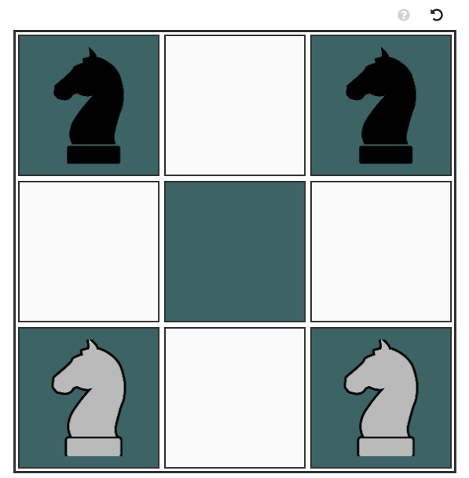

# Knights

Knight is a puzzle game based on [chess](https://en.wikipedia.org/wiki/Chess), where the goal is to swap between 4 knight pieces.

You can read rules directly in-game: [here](). 

## Screenshot
